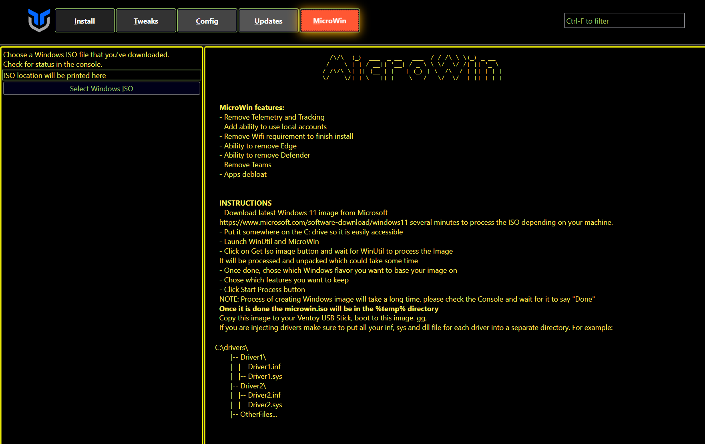

## **Windows 10/11 Debloating Guide**

### Disclaimer: NONE of these scripts will guarantee your Windows System to be  completly free of Microsoft Spyware! I recommend using 3rd party firewall to control your traffic!

## Programs & Scripts:

### [Chris Titus](https://github.com/ChrisTitusTech/winutil) - Meant to streamline installs, debloat, tweaks, troubleshooting, fix Windows updates and Create Custom Windows ISOs.

### [O&OS](https://www.oo-software.com/en/shutup10) - Adapt your security settings, protect your privacy, control location services, disable telemetry, data and diagnostics...

### [Privacy Sexy](https://github.com/undergroundwires/privacy.sexy) - Universal Debloater and PC Manager for Windows

### [Wintoys](https://apps.microsoft.com/detail/wintoys/9P8LTPGCBZXD?hl=en-US&gl=US) - Set up, debloat, optimize, repair, and tweak your operating system in a simple, time-saving manner.

### Other

[BloatyNosy](https://github.com/builtbybel/BloatyNosy) - Universal Debloater and PC Manager for Windows

[Privatezilla](https://github.com/builtbybel/privatezilla) - The simplest way to perform a quick privacy and security check of your Windows 10 copy. 

[Bloatbox](https://github.com/builtbybel/bloatbox) - Remove preinstalled apps on Windows. 

[Destroy Windows 10 spying](https://m.majorgeeks.com/files/details/destroy_windows_10_spying.html) - A portable app that can block anonymous data being sent, remove apps and more.

[Sycnex script](https://github.com/Sycnex/Windows10Debloater) - Removes Windows pre-installed unnecessary applications, stop some telemetry functions, disable unnecessary scheduled tasks...

## **[Recommended] Modify your own Windows ISO**

### **[ONLY WINDOWS 11] MicroWin** 

- [**Official Website**](https://www.ntlite.com/)
- [**Guide**](https://christitus.com/ntlite-guide/)

### **[ONLY WINDOWS 11] Tiny 11 Builder [Script]** 

- [**Github**](https://github.com/ntdevlabs/tiny11builder)

### **[Windows 10 & 11 ADVANCED USERS] NTLITE**

- [**Official Website**](https://www.ntlite.com/)
- [**Guide**](https://christitus.com/ntlite-guide/)

## **Pre-built Windows ISOs**

### **NTDEV Tiny Windows**

- [**Tiny 10**](https://archive.org/details/tiny-10-NTDEV)
- [**Tiny 11**](https://archive.org/details/tiny-11-NTDEV)

### **Atlas OS**

- [**Official Website**](https://atlasos.net/)
- [**Github**](https://github.com/Atlas-OS/Atlas)

<!-- ### **Windows Spectre**

- [**Official Website**](https://ghostspectre.the-ninja.jp/20H2.X64.html)
- [**Youtube**](https://www.youtube.com/c/GHOSTSPECTRE/videos) -->
